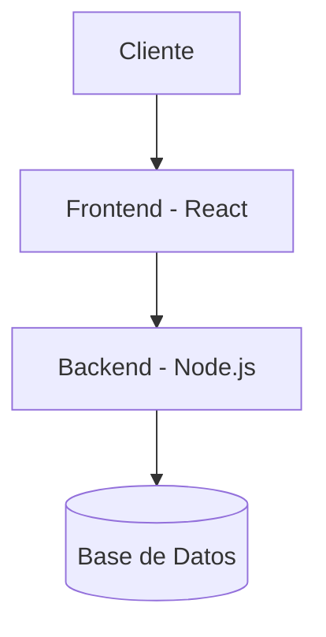

# Sistema de Gestión de Biblioteca (BookFlow)


BookFlow es una plataforma web interactiva diseñada para la automatización, control de préstamos y organización del inventario físico y digital de bibliotecas institucionales.

## Tabla de Contenidos
- [Descripción del Proyecto](#descripción-del-proyecto)
- [Instalación](#instalación)
- [Uso](#uso)
- [Estado de Funcionalidades](#estado-de-funcionalidades)
- [Contribuidores](#contribuidores)

## Descripción del Proyecto
Este proyecto resuelve la problemática de la pérdida de libros y optimiza el tiempo de registro de los bibliotecarios mediante un panel administrativo intuitivo, alertas automatizadas de devolución y búsquedas rápidas mediante indexación.

## Instalación
Para configurar el entorno de desarrollo local, ejecuta los siguientes comandos:

```bash
git clone https://github.com
cd laboratorio-readme
npm install
```

## Uso
Una vez completada la instalación, inicializa el servidor local con el comando:

```bash
npm start
```

## Estado de Funcionalidades

| Módulo / Función | Estado | Descripción |
| :--- | :--- | :--- |
| **Autenticación (Login)** | Listo | Acceso seguro para estudiantes y administradores. |
| **Búsqueda de Libros** | Listo | Filtros por título, autor y categoría de texto. |
| **Préstamos Automatizados**| En progreso | Generación de códigos QR para recojo en físico. |

## Pendientes
- [x] Diseñar el esquema de base de datos relacional.
- [ ] Implementar la pasarela de notificaciones por correo.

## Arquitectura
A continuación se detalla el flujo de datos del ecosistema de la aplicación:



## 👥 Contribuidores
* **David Antonio Ramos Flores** - *Desarrollador Principal* - [davidramosf-png](https://github.com)
