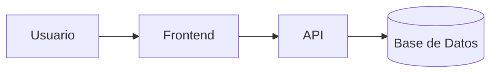

# Laboratorio README


Proyecto de práctica para aprender Markdown avanzado en GitHub.

## Descripción
Este repositorio documenta paso a paso mi aprendizaje de Markdown: tablas, listas de tareas, badges y diagramas.

## Estado de funcionalidades

| Función | Estado |
|----------|-------------|
| Login | Listo |
| Reportes | En progreso |

## Pendientes
- [x] Diseño de la base de datos
- [ ] Pruebas unitarias

## Arquitectura


---
# TAREA: README PROFESIONAL DE PROYECTO (BookFlow)


## Tabla de Contenidos
- [Descripción del Proyecto](#descripción-del-proyecto)
- [Instalación](#instalación)
- [Uso](#uso)
- [Contribuidores](#contribuidores)

## Descripción del Proyecto
BookFlow es una plataforma web interactiva diseñada para la automatización, control de préstamos y organización del inventario físico y digital de bibliotecas institucionales.

## Instalación
Para configurar el entorno de desarrollo local, ejecuta los siguientes comandos:

```bash
git clone https://github.com
cd laboratorio-readme
npm install
```

## Uso
Una vez completada la instalación, inicializa el servidor local con el comando:

```bash
npm start
```

## 👥 Contribuidores
* **David Antonio Ramos Flores** - *Desarrollador Principal* - [davidramosf-png](https://github.com/davidramosf-png)
