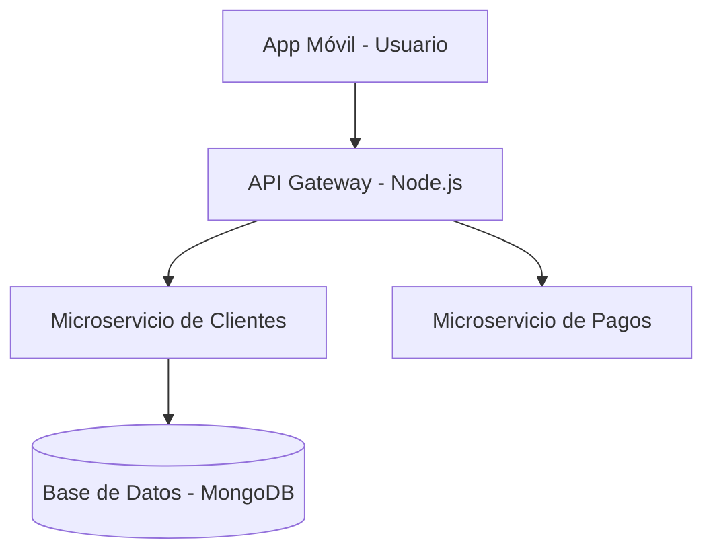

# 🏋️‍♂️ Sistema de Gestión de Gimnasios 


FitTrack es una plataforma de software diseñada para la administración integral de centros fitness, permitiendo el control de membresías, reserva de clases en tiempo real y el seguimiento personalizado de rutinas de entrenamiento.

## Tabla de Contenidos
- [Descripción del Proyecto](#descripción-del-proyecto)
- [Instalación](#instalación)
- [Uso](#uso)
- [Estado de Funcionalidades](#estado-de-funcionalidades)
- [Contribuidores](#contribuidores)

## Descripción del Proyecto
Este sistema centraliza el control de ingresos mediante códigos de acceso automatizados y soluciona la saturación de los establecimientos permitiendo a los usuarios reservar sus cupos y visualizar la disponibilidad de máquinas desde una aplicación móvil intuitiva.

## Instalación
Para configurar el entorno de desarrollo local de este sistema, ejecuta los siguientes comandos en tu consola:

```bash
git clone https://github.com
cd laboratorio-readme
npm install --production
```

## Uso
Una vez completada la descarga de librerías, inicializa el servidor de producción con el comando:

```bash
npm run dev
```

## Estado de Funcionalidades

| Módulo / Función | Estado | Descripción |
| :--- | :--- | :--- |
| **Control de Membresías** | Listo | Bloqueo automático de acceso para cuentas vencidas. |
| **Reserva de Clases** | Listo | Agendamiento en vivo para disciplinas grupales. |
| **Seguimiento Antropométrico**| En progreso | Gráficos evolutivos de porcentaje de grasa y peso. |

## Pendientes
- [x] Estructurar el modelo de datos de usuarios y contratos.
- [ ] Integrar la pasarela de pagos en línea (Visa/Mastercard).

## Arquitectura
A continuación se detalla el flujo de datos del ecosistema de la aplicación fitness:



## 👥 Contribuidores
* **David Antonio Ramos Flores** - *Desarrollador Principal* - [davidramosf-png](https://github.com)
