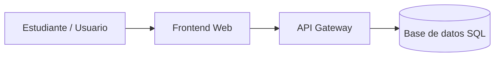

# Sistema de Gestión de Biblioteca Virtual - "BookSpace"


## Descripción
Este proyecto es una aplicación web diseñada para la reserva de libros, gestión de préstamos estudiantiles y control de inventario de textos en línea. Desarrollado como parte de la tarea del Laboratorio 5 aplicando Markdown avanzado.

## Tabla de Contenidos
- [Descripción](#descripción)
- [Instalación](#instalación)
- [Uso](#uso)
- [Estado de funcionalidades](#estado-de-funcionalidades)
- [Pendientes](#pendientes)
- [Arquitectura](#arquitectura)
- [Contribuidores](#contribuidores)

## Instalación
Para clonar este repositorio y configurar las dependencias en tu computadora, ejecuta los siguientes comandos en tu terminal:
```bash
git clone https://github.com
cd laboratorio-readme
npm install
```

## Uso
Para iniciar el servidor local de desarrollo de la biblioteca, ejecuta el siguiente comando:
```bash
npm run dev
```
Luego, puedes acceder al catálogo desde tu navegador en `http://localhost:3000`.

## Estado de funcionalidades

| Módulo | Estado | Prioridad |
| :--- | :--- | :--- |
| Catálogo de Libros | Listo | Alta |
| Reserva de Textos | En progreso | Alta |
| Sistema de Multas | Pendiente | Media |

## Pendientes
- [x] Diseño de la base de datos de libros y alumnos.
- [x] Maquetación de la interfaz de usuario principal.
- [ ] Pruebas unitarias de los módulos de reserva.
- [ ] Integración con la API de correos institucionales.

## Arquitectura


## Contribuidores
* **David Ramos** - *Desarrollador Principal* - [davidramosf-png](https://github.com)
